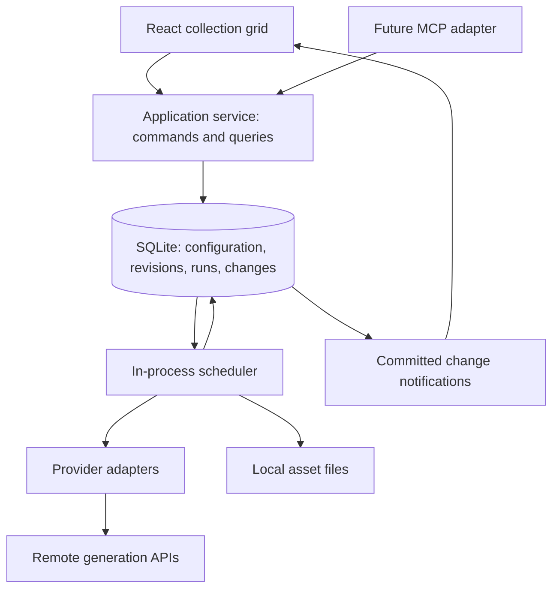

# Imaginator architecture proposal

Imaginator is a personal workspace for comparing image generation models. A collection is a grid: rows describe inputs, columns describe model configurations, and each intersection has a history of generation runs. The backend owns this state and generates results even when no browser is open.

This document proposes the first implementation. It assumes one user, one machine holding the data, and generation performed by external providers. Videos can use the same run and asset model later. No application code has been implemented yet.

**Recommended stack.** Use TypeScript throughout: React, Vite, shadcn/ui, and Tailwind for the browser; Node.js and Fastify for the server; Zod for shared command and result schemas; TanStack Query for browser server-state caching. Use SQLite with Drizzle and `better-sqlite3` for structured data, and ordinary local files for asset bytes. Use one server process, including its scheduler, with one small database worker thread.

My reason for choosing TypeScript is shared types, validation, tooling, and language across the UI, application service, and provider adapters. Python with FastAPI and asyncio would also handle the network concurrency: the decision is about reducing development overhead, not a claimed concurrency advantage. Python would become more attractive if local inference or substantial Python image-processing code became central. [FastAPI documents its async model](https://fastapi.tiangolo.com/async/), and [Fastify documents its TypeScript support](https://fastify.dev/docs/latest/Reference/TypeScript/).

The UI can start as an ordinary client-rendered application. [shadcn/ui supports Vite](https://ui.shadcn.com/docs/installation/vite). The same backend serves the built UI, commands, queries, notifications, and assets; development can use Vite's proxy. HTTP and future MCP handlers are thin adapters over the same application service.



**The domain model.** Separate editable configuration, immutable configuration revisions, execution state, and immutable assets. This makes history and asynchronous completion straightforward.

| Concept | Meaning and essential data |
| --- | --- |
| Collection | Stable slug, display name, `live` or `paused`, and ordered rows and columns. |
| Row | Stable collection-local ID, display label, pause flag, and current revision number. |
| Row revision | Immutable prompt, ordered input-asset references, and common generation controls. |
| Column | Stable collection-local ID, display label, and current revision number. Represents a model configuration, so the same model can occupy several columns with different settings. |
| Column revision | Immutable provider key, model identifier/version where available, and model-specific settings. |
| Cell | Logical `(collection, row, column)` address. Its current state and history are derived from runs; it does not initially need a separate table. |
| Generation run | A request for one cell using particular row and column revisions. Includes an immutable resolved specification, mutable execution status, ordered outputs, timings, and errors. |
| Asset | Immutable uploaded or generated media, with a global short ID, file location, media metadata, checksum, and provenance. |

A row revision groups the inputs used across the row. Each cell run records its own execution and outputs. This gives both useful kinds of history without versioning an entire collection whenever one prompt changes.

For example, `portraits/r3` revision 4 paired with column `model-a` revision 2 requests one run. Clicking “Generate again” creates another run against those same revisions. Editing the prompt creates row revision 5 and requests a new run in every compatible column.

A run can return multiple assets; the grid shows its first image and an output count, and the viewer shows all of them. Uploads and generated images use the same asset system. A generated asset points back to its producing run and output position, and the run's input references provide its lineage.

**IDs.** Use readable public identifiers directly as database keys, with compound keys for collection-local objects.

| Object | Example | Rule |
| --- | --- | --- |
| Collection | `portraits` | User-selected slug, immutable after creation; display name remains editable. |
| Row | `portraits/r3` | Increasing local number; never recycle deleted numbers. |
| Column | `portraits/model-a` | Stable local slug, independent of its editable label. |
| Cell | `portraits/r3/model-a` | Derived from its row and column. |
| Image | `img_k7m4p2qx` | Global prefix plus eight random readable characters. |
| Generation | `gen_v6t2n8ca` | Global prefix plus eight random readable characters. |
| Revision | `4` | Increasing number within its parent object. |

Use a lowercase alphabet that avoids ambiguous characters, enforce uniqueness in SQLite, and retry an insert on collision. These IDs are handles, not access-control secrets. Internal checksums and provider job IDs need not be short. A future video can use `vid_…` without changing asset references elsewhere.

**Inputs and model settings.** Start with a small common input vocabulary: prompt text, ordered image references with explicit roles, optional aspect ratio, and optional seed. Put model-specific controls such as quality, inference steps, and editing strength in the column's validated settings.

The row owns common controls; column settings cannot silently override those same fields. Model defaults fill genuinely unspecified values during request preparation. Materialize application-controlled defaults in the resolved run specification. If the provider has an undisclosed default, record that the field was omitted instead of inventing its value. Store effective values returned by the provider separately.

Each adapter declares model capabilities and validates the combination: accepted image roles/counts, allowed dimensions or ratios, supported controls, and output media kind. An incompatible cell shows a specific `unsupported` reason and incurs no provider request. Compatible cells in the same row still run. Do not silently discard an input image or approximate a setting that the model cannot honor.

These are comparisons of the same input intent, not a guarantee of identical model behavior. The same numerical seed does not establish equivalent randomness across models. The run inspector exposes the resolved provider settings and reported model version so differences remain visible.

An input points to a specific asset, for example `img_k7m4p2qx`, including when selected from another cell. Choosing “Use as input” pins that image. Regenerating the source cell does not replace the input or trigger downstream runs. This supports reuse within or across collections without introducing dependency scheduling, cycles, or cascading generation. Dynamic references such as “always use the latest output of this cell” can be a separate later feature.

**Regeneration rules.** Configuration updates, generation intents, and their change records commit together in a SQLite transaction. An intent is simply a queued run, not another queue product or a second job entity. Provider requests happen only after that transaction commits.

| Change | Work requested |
| --- | --- |
| Add a row | One run for each compatible column. |
| Change a row's prompt, input assets, or generation controls | New row revision; runs across that row. |
| Add a column | One run for each compatible row. |
| Change a column's model or generation settings | New column revision; runs down that column. |
| Change a title, label, or ordering | No generation. |
| Change provider credentials, concurrency, or transport timeout | No generation. |
| Change a reusable preset | Existing columns keep their copied settings; applying the preset is an explicit column edit. |
| Generate again | New run for the selected cell, row, or collection, even if inputs are identical. |

Provider administration is separate from experiment configuration. Credentials and scheduling limits never form part of the generation revision. A change that affects output semantics belongs in a column revision. Prefer duplicating a column to compare two settings side by side.

The UI keeps unsaved text locally and autosaves after a short quiet interval. The backend also gives automatic runs a brief persisted `not_before` delay, initially about one second. Further committed edits supersede queued runs for older revisions. This is coalescing, not a guarantee that an already submitted request can be undone. A no-op save creates no revision; restoring older content creates a new revision and requests generation normally.

Use a database uniqueness rule for the automatic run at `(collection, row, row revision, column, column revision)`. Retrying a command or waking the scheduler twice cannot create two automatic runs for the same combination. Manual reruns are distinguished from automatic runs and receive their own IDs; accept a client request key so retransmitting a manual command also remains idempotent.

Collection and row pause are dispatch gates. New collections and rows default to live. An empty or structurally incomplete row can be saved as a draft but cannot dispatch. A valid row is eligible when both its row and collection are live. Saving while paused still records revisions and intents, and resume dispatches only the latest eligible intents. Pause blocks automatic and manual dispatch alike; the UI requires resuming before a manual run can start.

Pause prevents new submission claims. A request already claimed as `submitting` may still reach the provider; submitted requests continue to be monitored and their outputs are downloaded, even after pause or a newer edit. Explicit cancellation is a separate operation, performed where the provider supports it. Locally cancelled or failed work is not silently recreated by the scheduler; another generation requires an explicit rerun or a new configuration revision.

**History and current results.** The current cell view is selected by configuration revisions and request order, never completion time. Store a monotonic run sequence so selection does not depend on timestamps or random IDs.

The newest requested run for the current row/column revisions determines current status. If it is still running or has failed, the previous successful image may remain visible with a clear status overlay and its revision/run label. It must not look like the new result. A successful older request that finishes late is added to history and cannot replace the current selection.

Keep execution status separate from relevance: an older run can succeed while no longer being current. A queued run made obsolete before submission can terminate as `superseded`; a submitted run retains its real provider lifecycle.

The cell viewer shows all previous runs, their prompt/settings snapshots, outputs, errors, and timestamps. At row level, selecting a revision shows the corresponding inputs and results across columns. Selecting history for inspection does not change the active configuration. “Restore this revision” is an explicit edit.

**Durable execution inside one process.** Persist run lifecycle and recovery fields in SQLite, while the Node process performs asynchronous network work. There is no separate Redis service or queue worker deployment in the first version.

The normal lifecycle is:

```text
queued → submitting → waiting for provider → downloading → succeeded
                    ↘ immediate result → downloading → succeeded
```

Errors may schedule a retry of the current safe step or end in `failed`. Cancellation can end in `cancelled`; an ambiguous submission can end in `needs_attention`. Persist the remote job ID/resume data, next action time, request idempotency key where supported, retry counters, deadlines, and structured errors. Maintain a small attempt log so network retries do not look like new experimental samples.

The scheduler checks pause/current-revision eligibility and claims a submission in the same transaction, then dispatches through the appropriate adapter. It claims other due lifecycle steps without those dispatch gates so paused or historical jobs can still finish. Use one active scheduler per data directory. It owns an in-memory set of executing steps; recover their durable states at startup. Multi-process leases and distributed locking are deferred until there is a concrete need for multiple schedulers.

Track three separate limits: total outstanding provider generations, outstanding generations per provider account, and simultaneous network operations. An accepted remote job occupies a generation slot until remote completion or confirmed cancellation, including time between polls. Submission rate limits and poll budgets are separate from those slot limits. Downloads get a bounded pool of their own. Choose conservative configurable defaults and honor provider retry delays.

For polling, store `next_action_at`, perform one asynchronous status request when due, and schedule the next action with backoff and jitter. A timer wakes the scheduler for the next due item. There is no busy loop or dedicated thread per remote job. Allocate work fairly across live collections so one large grid cannot monopolize all slots.

Async and direct-response providers fit the same lifecycle. Replicate documents both [asynchronous job handles and synchronous responses](https://replicate.com/docs/topics/predictions/create-a-prediction/); fal exposes an [asynchronous queue](https://fal.ai/docs/documentation/model-apis/inference/queue). These support using an explicit submit/poll boundary rather than depending entirely on SDK convenience methods that wait for completion internally.

Recovery behavior must distinguish where a failure occurred:

| Persisted situation | Recovery |
| --- | --- |
| Queued, never submitted | Recheck current revisions and pause state, then submit when eligible. |
| Remote job ID saved | Resume polling that same job. |
| Provider succeeded, local download incomplete | Retry acquiring the existing outputs; do not regenerate. |
| Submission may have succeeded, but no durable remote ID | Recover through provider idempotency or lookup if available; otherwise mark `needs_attention`. |
| Failed validation, unsupported input, or rejected credentials | Surface an actionable error; do not retry repeatedly. |

There is no general exactly-once guarantee across a local database and an external paid API. Persist `submitting` before the request, and persist the returned handle promptly, but acknowledge the crash/timeout window between provider acceptance and local persistence. For a provider with no idempotency or lookup, automatically repeating an ambiguous submission risks an extra charge. Keep its capacity reservation until resolved or explicitly abandoned. The UI can offer an explicit new run.

Do not resubmit because a poll failed, or because a deadline elapsed while the provider might still be running. Continue bounded recovery/monitoring or surface uncertainty. SDK-internal retries of generation creation must also be disabled or verified to use safe provider idempotency. Download failure after remote output expiry is a retrieval failure requiring an explicit rerun, not permission to generate silently.

On shutdown, stop new submissions and persist recoverable progress. On startup, resume known jobs, resolve interrupted submission states, supersede obsolete queued work, and rebuild concurrency counts before admitting more work. These properties are the main reason to persist the queue from the first version.

**Asynchrony and database access.** Use async provider SDK operations or `fetch`, streamed downloads, asynchronous filesystem APIs, and abortable timeouts. Limit large image work and thumbnail creation outside the JavaScript event loop. A function being declared `async` does not make blocking work inside it nonblocking; [Node's event-loop guidance](https://nodejs.org/learn/asynchronous-work/dont-block-the-event-loop) explains that distinction.

`better-sqlite3` uses a synchronous API. To preserve the requested responsiveness, put its connection and Drizzle access in one dedicated database worker thread with a small typed, promise-based repository interface. Send whole transactional operations to that worker, not one message per SQL statement, and never hold a transaction open across a provider request. This remains one operating-system process. The worker isolates a synchronous library; provider I/O stays on normal async APIs. [better-sqlite3 documents its synchronous interface and worker support](https://github.com/WiseLibs/better-sqlite3), and [Drizzle supports the driver](https://orm.drizzle.team/docs/sqlite/get-started-sqlite).

**Persistence and assets.** SQLite stores collections, rows and revisions, columns and revisions, runs and attempt records, assets and run-output links, input references, and a compact change log. Use foreign keys, migrations, indexes for due work and cell history, and WAL mode. SQLite permits concurrent readers with a writer in WAL mode but still serializes writes; keep transactions short and the database on local disk. [SQLite WAL documentation](https://www.sqlite.org/wal.html).

```text
data/
  imaginator.sqlite
  assets/
    img_k7m4p2qx/
      original.png
      thumbnail.webp
  tmp/
```

Store file locations relative to the data directory. Resolve all asset reads by asset ID through metadata rather than interpreting IDs as arbitrary filesystem paths. Serve original media and thumbnails through the backend. Keep API credentials in server-side environment configuration, and exclude them from stored run snapshots and browser responses.

An asset records media type, byte size, dimensions, optional duration, checksum, and upload or generation provenance. Stream bytes to a temporary file, validate the media, and atomically rename within the same filesystem before committing the ready asset record. Link all required outputs and mark the run successful in a database transaction after their original files are available. Thumbnails may finish separately.

Filesystem operations and SQLite commits are not one transaction. Use deterministic run/output staging references so a restart can reconcile a file written before its database commit. Clean up abandoned temporary or unreferenced files after a grace period. Never overwrite immutable original bytes. A missing original is a visible storage error, not a successful result.

Provider download URLs are retrieval locations, not permanent asset identities. Copy outputs locally promptly. For input images, the adapter must upload local bytes or use a provider-supported attachment mechanism: a remote provider cannot fetch a localhost asset URL. Retain temporary provider upload handles as execution metadata; keep the permanent specification tied to local asset IDs.

Removing a row or column archives its configuration/history. Removing a collection does not delete images used elsewhere. Start with explicit deletion and retain referenced assets, including historical references. A later garbage collector can compute reachability before removing bytes. For backup, stop the server and copy the data directory, or use a coordinated [SQLite online backup](https://www.sqlite.org/backup.html) and copy the immutable assets referenced by that snapshot.

**Reactive reads.** Use a normal command/query interface plus server-sent events for browser notifications. One stream can cover the application's relevant changes. SSE supports browser reconnection and event IDs, and TanStack Query can refetch the affected collection or cell when notified. [SSE documentation](https://developer.mozilla.org/en-US/docs/Web/API/Server-sent_events/Using_server-sent_events), [TanStack Query invalidation](https://tanstack.dev/query/latest/docs/framework/react/guides/query-invalidation).

Append a compact change record with a monotonically increasing sequence in the same transaction as each mutation. Notifications contain IDs, versions, and change kinds, not image bytes. This closes the gap where the database commits but the process exits before broadcasting. The database is the authoritative state; the change log is for notification delivery, not an event-sourced domain model.

A snapshot includes its change cursor, read in the same database transaction. The stream replays changes after that cursor and continues tailing them without a subscribe gap. On reconnect, replay from the last cursor; if that history was pruned, request a fresh snapshot. Coalesce refetches during bursts and bound slow-client buffering. The initial implementation can simply invalidate the collection query; finer cell queries can follow when collection sizes justify them.

UI edits use optimistic concurrency through expected edit versions, separate from generation revision numbers. A browser save based on an old version cannot overwrite a newer external-agent edit. Surface that conflict while preserving the local draft. The same rule applies to all transports.

**The conceptual application API.** Expose operations on experiments, rather than database tables or provider HTTP requests. Each command validates, persists its outcome, and returns promptly with IDs, edit versions, and queued run references. It does not wait for image generation.

| Area | Operations |
| --- | --- |
| Collections | Create, list, inspect, rename, duplicate, pause/resume, archive. A duplicate starts paused and copies current configuration and pinned inputs; it does not copy runs or generate immediately. |
| Rows | Add, update inputs with an expected version, reorder, pause/resume, inspect/restore revisions, archive. |
| Columns | Add a model configuration, revise or duplicate it, reorder, inspect revisions, archive. |
| Generation | Generate again for a cell/row/collection, inspect runs, request cancellation, explicitly resolve an uncertain submission. |
| Assets | Upload, inspect metadata/provenance, read image or thumbnail, reference as input. |
| Reading | Get a collection grid snapshot, list cell history, inspect a run's full resolved specification. |
| Capabilities | List configured providers/models and describe supported inputs and settings. |
| Changes | Read changes since a cursor, with optional bounded waiting. |

Support an atomic batch of row/column edits so an external client can construct or revise a grid without submitting intermediate combinations. Compute generation intents for the final batch state. For interactive edits, the short backend coalescing delay gives the same convenience on a smaller scale. A paused collection is useful for preparing a larger experiment before resuming it.

External agents can use ordinary reads and bounded waits; push support is optional. Future MCP tools delegate to these operations and return the same readable IDs and structured statuses. No embedded agent runtime is needed.

**Provider boundary.** Implement one adapter per provider, with model descriptions and settings schemas inside it. Use an official SDK where it exposes the required lifecycle, otherwise a small direct HTTP wrapper.

The conceptual contract is `describeModels`, `prepare`, `submit`, `poll`, and optional `cancel`. Preparation validates and resolves a row/column pair into a serializable request specification. Submission returns either a completed result or a durable remote handle. Polling returns pending, completed, or failed. Output descriptors identify bytes or retrievable files plus provider metadata; the central asset store owns their permanent persistence.

Keep preparation deterministic and free of network side effects. Temporary input uploads belong to execution and are recorded for recovery. Save the prepared provider payload, adapter version, model reference, source asset IDs, and resolved settings before submitting, excluding secrets. Replaying a historical experiment uses its recorded configuration with an explicit new run; a backend deployment never automatically regenerates old experiments.

The application owns lifecycle, retries, scheduling, persistence, and notifications. Adapters own provider-specific mapping, capabilities, remote handles, cancellation behavior, and error classification, including whether a failed submission is definitely unaccepted or ambiguous. Provider progress is optional; show a stage when meaningful progress percentages are unavailable.

**Implementation sequence.** Start with one repository containing `web`, `server`, and shared contracts, with ordinary server modules for the application service, scheduler, providers, database, and assets. They are module boundaries, not separate services.

1. Build SQLite persistence, revisions, short IDs, commands/queries, and asset ingestion. Use a deterministic fake provider to exercise job lifecycle and recovery without paid calls.
2. Build the reactive grid, prompt editing, column configuration, pause/resume, cell status, and history viewer.
3. Add two real providers with different execution styles to verify the abstraction. Exercise upload-to-input reuse and copying generated images between collections.
4. Add the thin MCP transport once these operations behave consistently from the UI and service tests.

The highest-value verification cases are duplicate commands, row-only/column-only invalidation, pause followed by resume, out-of-order completions, edits during active runs, partial row failures, cancellation races, a crash around submission, restart during polling/download, immutable input reuse, and reconnecting after missed notifications. Use temporary SQLite databases and a controllable fake provider for these tests.

The first usable milestone is a live collection with several prompts and two model columns, durable background generation, automatic UI updates, prior-result inspection, and reuse of any output as a pinned input. Keep the initial system focused on that loop; its existing domain boundaries can support video outputs and a separate worker process when those become concrete requirements.
