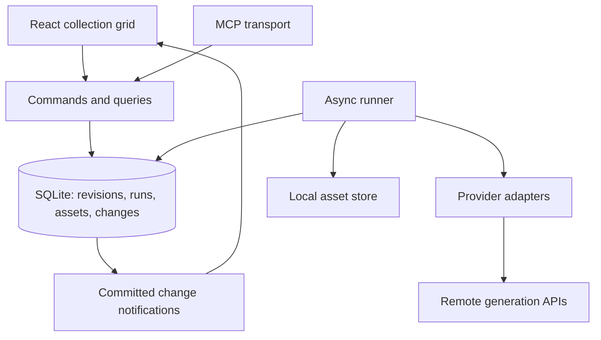

# Imaginator architecture

This is the authoritative design for Imaginator's first implementation. The
repository currently contains design documents, not application code.

Imaginator is a personal workspace for comparing image generation models. A
**collection** is a grid: rows describe inputs, columns describe model
configurations, and each cell has a history of generation runs. Editing a live
collection requests results automatically. The backend owns execution and keeps
working when no browser is open. The UI and an MCP client use the same API.

The first version assumes one user, one machine holding the data, and external
generation providers. It uses one server process, SQLite, and local asset files.

## 1. Stack and module boundaries

| Layer | Choice | Purpose |
| --- | --- | --- |
| Language | TypeScript, pnpm workspaces | Share contracts, validation, and tooling across the server, UI, and MCP. |
| HTTP | Node.js, Hono, Zod | Serve commands, queries, notifications, assets, and the built UI. |
| UI | Vite, React, Tailwind, shadcn/ui | Collection grid, editing, and result inspection. |
| Browser data | TanStack Query and server-sent events (SSE) | Cache snapshots and refetch after committed changes. |
| Metadata | SQLite, Drizzle, `better-sqlite3` | Store configuration, revisions, runs, assets, and changes. |
| Media | Local filesystem and sharp | Preserve originals; read metadata and create thumbnails. |
| Execution | In-process async runner over the `runs` table | Durable work without Redis or a separate worker deployment. |
| MCP | TypeScript MCP SDK | Thin tools over the shared command/query registry. |

TypeScript reduces development overhead across these components. Python with
asyncio could also handle the network concurrency; the language choice does not
depend on a concurrency advantage.

```text
imaginator/
  packages/
    core/       # domain contracts, Zod schemas, IDs, pure request resolution
    server/     # commands/queries, repositories, runner, provider adapters,
                # asset store, HTTP/SSE, MCP
    web/        # React application
  data/         # runtime data, gitignored
    imaginator.sqlite
    assets/
    tmp/
```

`core` has no database, filesystem, or network I/O. Provider-specific resolution
functions remain pure even when colocated with server adapters. Provider secrets
and execution code stay on the server. These are module boundaries within one
deployment.



## 2. Domain model

Keep editable configuration, immutable revisions, execution state, and immutable
assets separate.

| Concept | Essential data and meaning |
| --- | --- |
| Collection | Immutable slug, editable title/description, live/paused status, ordered rows and columns, edit version. |
| Row | Stable collection-local ID, label/notes, position, pause flag, current revision, edit version. |
| Row revision | Immutable prompt, ordered input-asset references with roles, and common generation controls. |
| Column | Stable collection-local ID, label, position, current revision, edit version. |
| Column revision | Immutable provider/model reference, model version where available, and model-specific settings. |
| Cell | Logical `(collection, row, column)` address; current state and history come from runs. No cell table initially. |
| Run | One request for a cell at specific row/column revisions; immutable resolved request and mutable execution state. |
| Asset | Immutable uploaded or generated media with metadata, checksum, and provenance. |

A column represents a model configuration. Two columns can use the same model
with different settings. A row revision groups the inputs compared across those
columns without creating a revision of the whole collection.

A run may produce several assets. Preserve their order; the grid shows the first
image and an output count. Generated assets identify their producing run and
output position. Following the run's input references gives their lineage.

### Identifiers

Use readable public identifiers as database keys, with compound keys for local
objects.

| Object | Example | Rule |
| --- | --- | --- |
| Collection | `portraits` | User-selected slug; immutable after creation. Rename changes the display title. |
| Row | `portraits/r3` | Increasing local number; never reuse an archived row's number. |
| Column | `portraits/model-a` | Local slug independent of the editable label; retain it when archived. |
| Cell | `portraits/r3/model-a` | Derived address. |
| Image asset | `img_k7m4p2qx` | Global prefix plus eight random readable characters. |
| Run | `gen_v6t2n8ca` | Global prefix plus eight random readable characters. |
| Revision | `4` | Increasing number within its row or column. |

Random IDs use a lowercase alphabet without ambiguous characters. Enforce
uniqueness in SQLite and retry insertion on collision. IDs are handles, not
access-control secrets. A future video asset can use `vid_…`.

## 3. Inputs, settings, and request resolution

Start with a small common vocabulary: prompt, ordered image references with
explicit roles, optional aspect ratio, and optional seed. The row owns these
controls. Model-specific controls such as quality, steps, output count, and
editing strength belong to the column's validated settings. Columns cannot
silently override row controls. There are no collection-level generation
defaults or reusable presets in the first version; duplicate a column to reuse
its configuration.

The following TypeScript sketches describe the contracts; Zod schemas define
their runtime validation. `JsonObject` denotes serializable JSON object data.

```ts
interface RowRevision {
  revision: number;
  prompt: string;
  inputs: Array<{ assetId: string; role: string }>;
  controls: { aspectRatio?: string; seed?: number };
}

interface ColumnRevision {
  revision: number;
  provider: string;
  model: string;
  modelVersion?: string;
  settings: JsonObject;
}

interface ResolvedRequest {
  provider: string;
  model: string;
  modelVersion?: string;
  adapterVersion: string;
  prompt: string;
  inputs: Array<{ assetId: string; role: string }>;
  controls: RowRevision['controls'];
  settings: JsonObject;
  payload: JsonObject;              // provider payload with local asset references
  omittedProviderDefaults: string[];
}

type Resolution =
  | { ok: true; request: ResolvedRequest }
  | { ok: false; code: string; message: string };
```

`resolve(rowRevision, columnRevision)` is deterministic and has no network side
effects. Each model declares capabilities and validates accepted image
roles/counts, dimensions or ratios, controls, and output media kind. An
incompatible cell shows a specific `unsupported` reason and makes no provider
request. Compatible cells in the same row still run. Do not discard input images,
drop explicitly requested controls, or approximate unsupported settings.

Application-controlled defaults fill unspecified values and are materialized in
the resolved request before queueing. Record undisclosed provider defaults as
omissions; store effective values returned by the provider separately. Temporary
uploads replace local asset references only during execution, with upload handles
saved in checkpoints. Credentials never enter the request snapshot.

The stored request remains fixed even if the registry or adapter changes. A
deployment does not create runs or rewrite queued requests. If an adapter can no
longer execute a stored request faithfully, surface an actionable error. New runs
record the resolver/adapter version and defaults used for them. Snapshots make
experiments inspectable; they do not promise identical output from an external
model or comparable randomness from the same seed across models.

**Input reuse pins an asset.** “Use as input” stores a specific asset ID, including
when the image came from another collection. Regenerating its source cell neither
replaces the input nor triggers downstream runs. Dynamic references to a cell's
latest output are deferred.

## 4. Revisions and generation rules

Configuration changes, their queued runs, and their change records commit in one
SQLite transaction. A queued run is the generation intent; there is no separate
job entity. Provider requests begin only after commit.

| Operation | Result |
| --- | --- |
| Add a row | Request one automatic run per compatible column. |
| Edit a row's prompt, assets, or controls | Create a row revision and request runs across that row. |
| Add a column | Request one automatic run per compatible row. |
| Edit a column's model/settings | Create a column revision and request runs down that column. |
| Change a title, label, notes, or ordering | Update metadata; request no runs. |
| Change credentials, concurrency, or transport timeout | Update administration; request no runs. |
| Duplicate a column | Copy its configuration into an independent column and request runs there. |
| Duplicate a collection | Copy current configuration and pinned inputs into a paused collection; copy no run history. |
| Generate again | Request a new manual run for each selected cell, even with identical inputs. |
| Restore an older revision | Copy its content into a new revision and request runs for the affected row or column. |

A save with no semantic change creates no revision or run. Restoring content that
already matches the active configuration is also a no-op. Otherwise, restoration
generates a fresh sample; it does not automatically reuse a previous result.
Inspecting history is read-only. Request hashes may help diagnostics later, but
do not determine whether a cell needs work or whether an old run becomes current.

### Coalescing and idempotency

The UI keeps a local draft and autosaves after a short quiet interval, with
blur/Enter also committing edits. Automatic runs have a persisted `not_before`
delay, initially about one second. Further committed edits mark queued runs for
obsolete revisions `superseded`. Once a run is claimed for submission, it follows
the execution rules in section 6.

Enforce a partial unique constraint for automatic runs on:

```text
(collection, row, row_revision, column, column_revision)
WHERE trigger = 'automatic'
```

Keep this uniqueness across every run status. A failed, cancelled, or superseded
run is not a missing run that the scheduler should recreate.

All mutations require a client request key. Persist the command result with the
mutation so retransmits return the original IDs, including for add, duplicate,
batch, and manual generation commands. Look up an existing receipt before
checking edit versions. Reusing a key with different input is an error. This is
separate from provider idempotency: preventing duplicate local runs does not
prove a remote API accepted a request only once.

An atomic batch applies row/column edits and computes runs for the final state.
It lets an external client build a grid without generating intermediate
combinations.

### Pause, drafts, and archive

Collection and row pause are dispatch gates. New collections and rows default
to live. An empty or structurally incomplete row can be saved as a draft, but
cannot dispatch. Valid edits while paused still record revisions and queued
runs; resume dispatches only the latest eligible runs. A duplicated collection
can therefore have queued work while paused without making provider calls.

Pause blocks automatic and manual dispatch. Manual generation requires the
selected rows and collection to be live; otherwise the command returns a clear
paused error. Archive also blocks dispatch and supersedes queued work for the
archived objects. Submitted work continues into history.

Pause prevents new submission claims. A run already claimed as `submitting` may
still reach the provider. Neither pause nor a newer edit cancels that work.

## 5. History and current cell state

Persist an increasing `sequence` within each cell, allocated transactionally for
every requested run. Current status comes from the highest sequence for the
active row and column revisions, never completion time or a random ID.

If that run is pending, failed, or cancelled, the viewer may keep a previous
successful image visible with its own revision/run label and a current-status
overlay. An older run finishing late enters history without replacing the
current selection. Execution status and relevance are independent: an obsolete
run can still succeed.

The cell viewer shows every run's request snapshot, ordered outputs, errors,
timings, and reported provider metadata. Row history filters runs by the selected
row revision and shows the column revision used by each run. It does not imply
that the whole collection had a single shared revision. Inspecting history does
not change the active configuration; restoring it is the explicit edit described
above.

## 6. Durable execution

### Run record and lifecycle

```ts
type RunStatus =
  | 'queued' | 'submitting' | 'waiting' | 'downloading'
  | 'succeeded' | 'failed' | 'cancelled' | 'superseded'
  | 'needs_attention';

interface Run {
  id: string;
  cell: { collection: string; row: string; column: string };
  rowRevision: number;
  columnRevision: number;
  sequence: number;
  trigger: 'automatic' | 'manual';
  request: ResolvedRequest;            // immutable after queueing
  status: RunStatus;
  notBefore: string;
  checkpoint?: JsonObject;            // server-only, serializable resume state
  providerRequestKey?: string;
  deadline?: string;                  // assigned at admission, preserved on recovery
  retryCounts: Record<string, number>;
  error?: { code: string; message: string; operation: string };
  outputs: string[];                  // ordered asset IDs, backed by output links
  timing: { queuedAt: string; startedAt?: string; finishedAt?: string };
}
```

Also persist output retrieval/staging descriptors, cancellation requests, capacity
reservations, and a small attempt log. Record cost and effective provider values
when available. Checkpoints and retrieval URLs are execution data, distinct from
the permanent request snapshot and public run view.

```text
queued → submitting → waiting → downloading → succeeded
                    ↘ direct result → downloading → succeeded

queued → superseded                  obsolete before submission
queued → cancelled                   explicitly cancelled before submission
active → failed                      known failure with no uncertain remote work
active → cancelled                   remote cancellation confirmed
active → needs_attention             submission or recovery cannot be resolved
```

Here `active` means `submitting`, `waiting`, or `downloading`. These are persisted
phases within one run, not separate scheduler jobs. Safe network retries append
attempts to that run. An explicit rerun creates a new run and sequence. Failed or
cancelled runs never automatically create replacements.

### Runner and concurrency

Keep exactly one runner per data directory, protected by a process ownership
lock, and an in-memory map of active tasks. Refuse to start a second runner for
that directory. The runner:

1. Selects the oldest due queued run whose provider account has capacity.
2. Rechecks current revisions, draft/unsupported state, pause, and archive gates;
   claims the eligible run as `submitting` and reserves global/provider capacity
   in the same transaction.
3. Starts an async task with error handling and cleanup.
4. Wakes when work is queued, capacity changes, a collection/row resumes, or the
   next eligible queued run's `not_before` expires.

Use two configurable limits: a global cap and a cap per provider account. A run
holds both slots through input preparation, generation, polling, and persistence
of its original outputs. Sleeping between polls does not release capacity.
Persist reservation state with the claim and subsequent transitions to rebuild
these counts after restart. An uncertain remote run retains its reservation until
resolved or explicitly abandoned.

Use simple queue order among eligible runs. Process outputs sequentially within
a run initially. Provider polling lives inside async `generate()` or `resume()`
calls, using abortable sleep, backoff, and jitter. Poll timers stay in memory;
restart chooses a fresh delay while preserving deadlines and retry counts. The
queued-run `not_before` is only for edit coalescing. Separate download pools,
per-collection fairness, and distributed leases are deferred.

### Recovery and retries

| Persisted situation | Recovery |
| --- | --- |
| Queued, never submitted | Recheck eligibility and submit when due and capacity is available. |
| Remote handle saved and adapter supports resume | Resume the same job. Do not call `generate()` again. |
| Interrupted remote job cannot be resumed | Mark `needs_attention` and retain its handle for inspection. |
| Provider succeeded, local output acquisition incomplete | Retry downloading or finalizing those outputs, without generation. |
| Submission may have succeeded, but no durable remote handle exists | Recover using provider idempotency or lookup if supported; otherwise mark `needs_attention`. |
| Submission is known not to have been accepted | Retry only if the classified error permits it, within the original budget. |
| Invalid request or rejected credentials | Show an actionable error; do not repeat automatically. |

There is no general exactly-once guarantee across SQLite and a paid remote API.
Persist `submitting` before the request and save the remote handle immediately
after acceptance. A crash or timeout can still occur between acceptance and
local persistence. Blindly repeating that submission can create an extra charge.

Retry only operations known to be safe: polling, downloading, a confirmed
unaccepted submission, or submission protected by the provider's actual
idempotency contract. A generic HTTP helper must not retry every generation POST
on a timeout or 5xx. Disable SDK submission retries unless their safety is known.
Persist bounded retry counts and honor provider retry delays.

A failed poll or elapsed deadline is not evidence that the remote job stopped.
Continue bounded recovery or surface `needs_attention`; never resubmit it as a
new generation. Expired output URLs are a retrieval failure and require an
explicit rerun if the output cannot be recovered.

The resolve operation for `needs_attention` can resume a recovered job, record a
verified provider outcome, or explicitly abandon tracking and release its
reservation. Abandoning does not claim that the provider cancelled the job.
Requesting a new sample remains a separate manual run.

### Cancellation and process lifecycle

Cancel queued work locally. For submitted work, record the cancellation request
and use the adapter's cancel operation when available. Keep monitoring until the
provider confirms an outcome. A cancellation request, local `AbortSignal`, or
network disconnect does not establish remote cancellation. If completion wins
the race, save the output and record success. Unsupported cancellation leaves
the job monitored and explains that result to the client.

On shutdown, stop admission and abort local waits/I/O while preserving recovery
checkpoints. Do not request remote cancellation just because the server stops.
On startup, rebuild reservations before admitting new runs, recover unfinished
work, and supersede obsolete queued runs. Recovery continues for paused,
archived, and historical work. Already admitted jobs remain monitored if caps
were lowered; their reservations block new admission until capacity is available.

## 7. Provider adapters

Implement one adapter per provider, with a model registry and model-specific
schemas. Aggregators can expose many models through one adapter. Use an official
SDK when it exposes the required lifecycle; otherwise wrap HTTP directly.

```ts
interface ModelSpec {
  id: string;
  name: string;
  kind: 'image' | 'video';
  capabilities: {
    inputRoles: string[];
    maxInputImages: number;
    seed: boolean;
    aspectRatios?: string[];
    sizes?: string[];
    maxOutputs: number;
  };
  settingsSchema: ZodType;
}

interface Provider {
  id: string;
  models: ModelSpec[];
  resolve(row: RowRevision, column: ColumnRevision): Resolution;
  generate(request: ResolvedRequest, ctx: GenerateContext): Promise<GenerateResult>;
  resume?(
    request: ResolvedRequest, checkpoint: JsonObject, ctx: GenerateContext
  ): Promise<GenerateResult>;
  cancel?(checkpoint: JsonObject): Promise<'confirmed' | 'pending' | 'unsupported'>;
}

interface GenerateContext {
  signal: AbortSignal;
  deadline: string;
  providerRequestKey?: string;
  retryCounts: Readonly<Record<string, number>>;
  asset(id: string): Promise<{ path: string; mime: string }>;
  checkpoint(state: JsonObject): void; // durable commit before returning
  recordAttempt(attempt: JsonObject): void; // persists operation and retry count
  sleep(ms: number): Promise<void>;
  log(message: string): void;
}

interface GenerateResult {
  outputs: Array<
    | { url: string; mime?: string }
    | { bytes: Uint8Array; mime: string }
  >;
  cost?: { amount: number; currency: string };
  providerMeta?: JsonObject;
}
```

`generate()` handles a direct response or submission plus polling, and resolves
when the provider's outputs are available. Immediately after acceptance, save the
remote handle and required resume metadata through `checkpoint()` before polling
or sleeping. This callback commits synchronously with the selected SQLite driver.
Upload handles and other preparation progress can also be checkpointed; a
checkpoint alone does not imply generation was accepted.

`resume()` continues the same remote job and returns the same result shape. It
must never create a replacement. Providers with recoverable handles should
implement it; providers without recovery expose interruptions to the user.

The application owns admission, run transitions, durable checkpoints, attempt
records, assets, and notifications. Adapters own provider mapping, polling,
handles, cancellation, and error classification, including whether submission
is definitely unaccepted or ambiguous. Shared helpers enforce bounded safe
retries. Show a stage when the provider has no meaningful progress percentage.

Ship a controllable fake provider first. It creates images with sharp and can
simulate direct responses, remote handles, delays, failures, and cancellation
races without paid calls.

## 8. Persistence and assets

SQLite stores collections, rows/revisions, columns/revisions, runs/attempts,
command receipts, assets, run-output links, input references, and a compact change
log. Use foreign keys, migrations, WAL mode, and indexes for queued work and cell
history. Keep the database on local disk.

Use `better-sqlite3` directly on the main thread behind repository functions.
Application services own short, bounded transactions; no transaction spans a
provider request or filesystem operation. Use async provider HTTP, filesystem
I/O, and sharp operations. Measure query duration and event-loop delay before
introducing a database worker. Large scans and synchronous disk work can still
stall the process.

```text
data/
  imaginator.sqlite
  assets/
    img_k7m4p2qx/
      original.png
      thumbnail.webp
  tmp/
```

Assets record media kind, MIME type, bytes, dimensions, optional duration,
checksum, provenance, and optional label. Resolve reads by asset ID through
metadata; store paths relative to the data directory. Serve originals and
thumbnails through the backend with immutable cache semantics.

### Ingest and recovery

1. Persist remote output descriptors before downloading. For inline results,
   stage bytes locally and record staging references as soon as possible.
2. Persist the `downloading` phase and descriptors needed to resume acquisition.
3. Stream each output to a temporary file, validate media and compute its
   checksum/metadata, then atomically rename within the same filesystem.
4. Commit ready asset records, ordered output links, and run success together
   after all required original files exist. Thumbnails can finish separately.

Filesystem writes and SQLite commits are not one transaction. Use deterministic
run/output staging references so recovery can identify files written before their
database commit. Retry output acquisition or resume the original provider job
when possible. If a direct response is lost before local staging and the provider
offers no recovery, surface the interruption. Never generate a replacement just
because local storage failed.

Never overwrite original bytes. A missing original is a visible storage error.
Clean abandoned temporary files after a grace period, while retaining files used
by unfinished recovery. Provider output URLs are temporary retrieval locations;
copy their bytes locally promptly. For input images, upload local bytes or use a
provider attachment mechanism; providers cannot fetch localhost asset URLs.

### Retention and backup

Removing a row, column, or collection archives it and retains configuration,
history, and referenced assets. Historical request inputs count as references.
Asset deletion is explicit and allowed only when no retained object references
it; permanent history deletion and bulk garbage collection are deferred. Reusing
an image in another collection keeps it independently reachable.

For the first version, stop the server and copy the data directory for backup.
A later live backup can coordinate a SQLite snapshot with copies of all immutable
assets referenced by that snapshot.

## 9. Reactive reads and concurrent edits

Every mutation appends a compact change record with an increasing sequence in
the same transaction as its data changes. Notifications contain IDs, versions,
and change kinds. The change log delivers notifications; SQLite's domain tables
remain the source of truth.

A collection snapshot includes its change cursor, read in the same transaction.
The SSE stream replays changes after that cursor and continues tailing without a
subscription gap. An in-process post-commit notification wakes stream readers;
the durable log supplies the events. On reconnect, replay after the last cursor.
If retained history no longer covers it, tell the client to fetch a new snapshot.

Initially, the UI invalidates and refetches the collection query after relevant
events. Coalesce refetches during bursts and bound slow-client buffering. Finer
cell queries can follow when collection sizes justify them.

Use expected edit versions for updates, separate from generation revision
numbers. Metadata and pause changes can advance edit versions without creating
generation revisions. A stale browser or agent edit returns a conflict and
preserves the local draft. Apply this rule to every transport and validate all
expected versions before committing a batch.

## 10. Command/query registry and transports

Define each operation once, with its name, Zod input/output schemas, and handler:

```ts
interface Operation<I, O> {
  name: string;
  kind: 'command' | 'query';
  input: ZodType<I>;
  output: ZodType<O>;
  run(input: I, context: ApplicationContext): Promise<O>;
}
```

Handlers invoke application services and repositories. Commands validate,
commit, and return promptly with updated objects, edit versions, a change cursor,
and queued run references. They do not wait for provider generation.

| Group | Operations |
| --- | --- |
| `models` | List configured models and describe capabilities/settings schemas. |
| `collections` | Create, list, get grid snapshot, update title/description, duplicate, pause/resume, archive. |
| `rows` | Add (including arrays), update, reorder, pause/resume, list/restore revisions, archive. |
| `columns` | Add, update, duplicate, reorder, list/restore revisions, archive. |
| `cells` | Get current view and history; regenerate a cell, row, or collection. |
| `runs` | Inspect request/execution, request cancellation, resolve uncertain work. |
| `assets` | Upload, list, get metadata/provenance, label, read original/thumbnail, delete if unreferenced. |
| `changes` | Read after a cursor, optionally waiting for a bounded interval. |
| `batch` | Apply an atomic group of configuration edits. |

Use readable addresses such as `portraits/r3/model-a` wherever a cell is expected,
and run IDs for unambiguous history references. A grid snapshot includes row
inputs, column configurations, edit/revision numbers, current run statuses,
unsupported reasons, asset IDs/thumbnail URLs, and history counts. It is the
primary document for both browser and external-agent reads.

HTTP exposes registry operations at `POST /api/<group>.<operation>`, with optional
GET aliases for reads. Assets and `/api/events` use dedicated binary/streaming
handlers. Uploads use a binary transport into the same asset ingestion service;
large image bytes do not pass through ordinary JSON command envelopes.

MCP tools reuse the registry's validation and application behavior, translating
results into structured content and image content where supported. Tool names
can map dots to underscores. Streamable HTTP can run in the server; a separate
stdio bridge calls the existing server and does not start another runner.

Agents can perform `edit → changes wait → inspect`. Waiting takes a cursor and a
timeout, returns immediately when newer changes already exist, and never assumes
that a quiet or paused collection has finished its pending work. Push support and
an embedded agent runtime are unnecessary for this loop.

## 11. UI

| Route | View |
| --- | --- |
| `/` | Collections with live/paused state, cell counts, and pending work. |
| `/c/:slug` | Grid with editable row prompts/inputs, column model/settings controls, pause/resume, and add row/column actions. |
| `/c/:slug/:row/:column` | Large result, output selector, run history, resolved request, errors, regenerate/cancel, and “Use as input.” |
| `/assets` | Uploaded/generated asset library with previews, labels, and input selection. |

Cells show generation phase or a specific draft, unsupported, paused, failed, or
uncertain state. Preserve the distinction between the current run's status and a
previous image displayed beneath it. Show errors per cell so a partial row failure
does not hide successful comparisons. History inspection and revision restoration
are separate actions.

Use TanStack Query for server snapshots and local component state for unsaved
drafts. The backend remains responsible for validation, revision creation,
coalescing, and generation regardless of which client made the edit.

## 12. Configuration and implementation sequence

Server configuration supplies the data directory, localhost port, global
concurrency, provider-account concurrency, credentials, and operation timeouts.
Keep credentials in server-side environment configuration, excluded from browser
responses and request snapshots. The model registry lives in code. Development
uses Vite's proxy; production serves the built UI from the same backend.

Build in this order:

1. Shared contracts, IDs, revisions, SQLite repositories, transactional commands,
   and asset ingestion.
2. Runner, checkpoints/recovery, fake provider, change log, HTTP, and SSE. At this
   point an HTTP client can drive the complete generation loop.
3. Collection grid, editing, pause/resume, cell status, history, and asset reuse.
4. Two real providers with different execution styles, validating both direct
   response and recoverable remote-job behavior.
5. MCP transport over the same registry and services.

Use temporary SQLite databases and a controllable fake provider to verify:

- Duplicate commands and automatic-run uniqueness, including terminal runs.
- Row-only/column-only generation, no-op saves, restore behavior, and atomic batches.
- Draft/unsupported cells, pause/resume, archive, and obsolete queued work.
- Out-of-order completions, manual reruns, partial failures, and cancellation races.
- Crashes around submission, provider-handle persistence, polling, and downloads.
- File/database commit gaps, pinned input reuse, and reservation recovery.
- Snapshot/stream races, missed notifications, and conflicting browser/agent edits.

The first usable milestone is a live collection with several prompts, two model
columns, durable background generation, automatic UI updates, prior-result
inspection, and reuse of any output as a pinned input.

Defer video-specific adapters/UI, dynamic input dependencies, reusable presets,
collection export/import, permanent history deletion and bulk asset GC, detailed
cost reporting, multi-user/network access, and multiple workers. Keep the current
boundaries suitable for adding these when needed.
